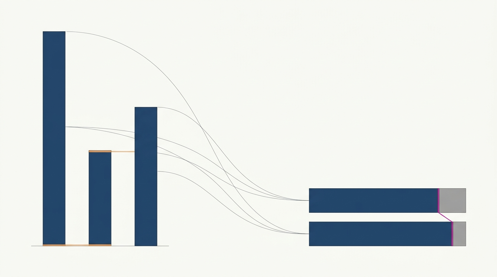
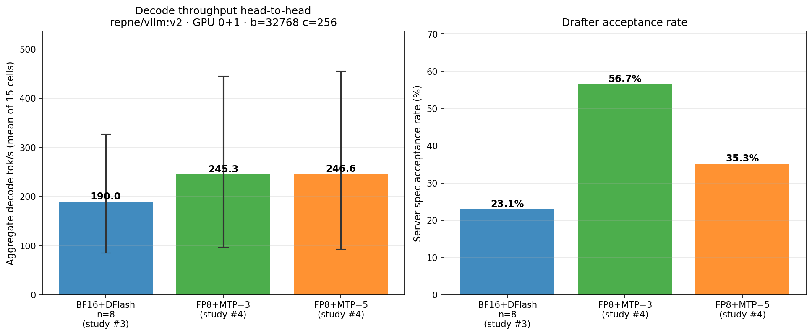
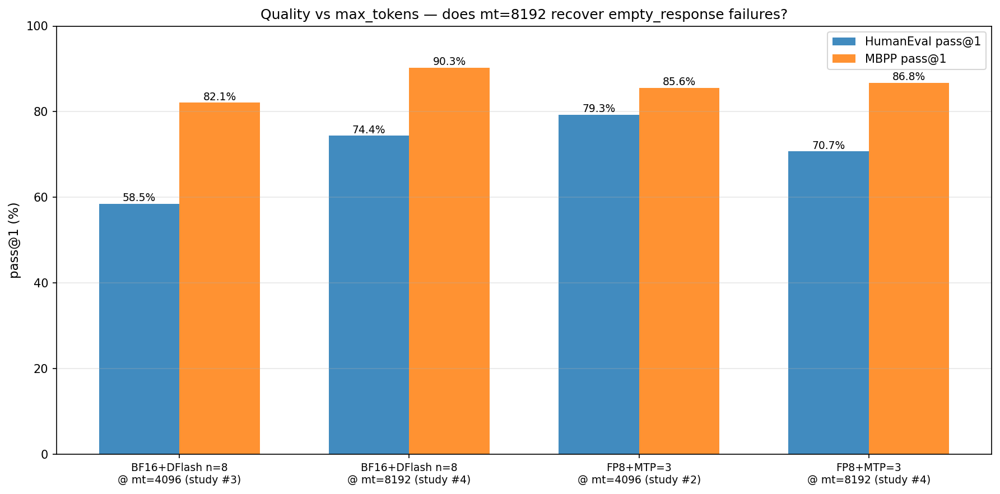
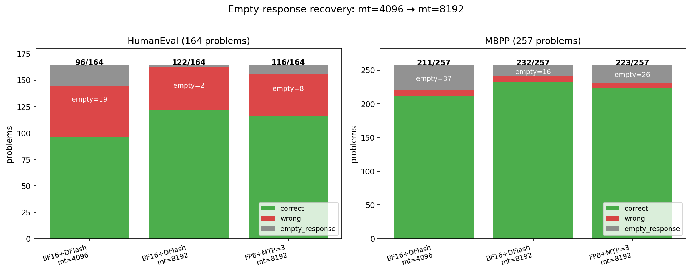
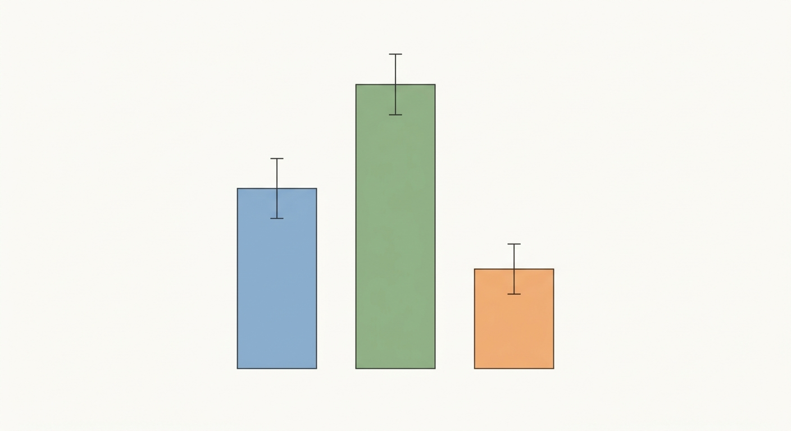
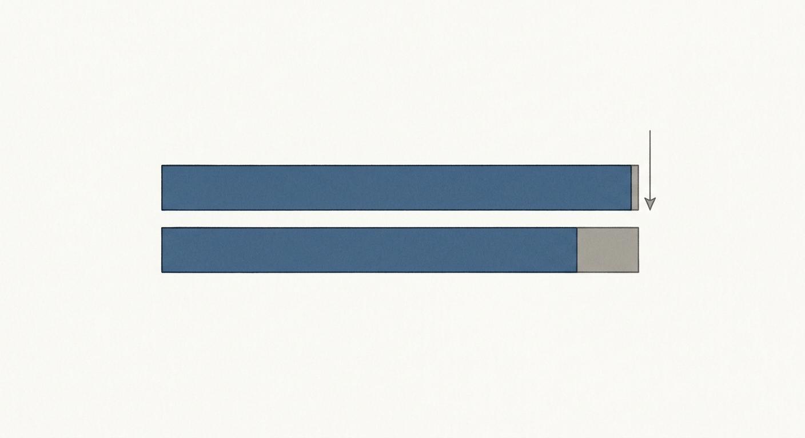

[](https://github.com/jcartu/qwen-bench)

<div align="center">

</div>

# Qwen3.6-27B: FP8+MTP Speed vs BF16+DFlash, and `max_tokens=8192` Quality Recovery

> Part of the [`qwen-bench`](https://github.com/jcartu/qwen-bench) hub.
> Follow-up to [study #2 (FP8+MTP characterization on `:latest`)](https://github.com/jcartu/qwen-bench-2026-05-fp8-mtp) and [study #3 (BF16+DFlash sweep on `:v2`)](https://github.com/jcartu/qwen-bench-2026-05-dflash-v2-sweep).
> Answers two questions: (1) does FP8+MTP retain its throughput lead on the newer `repne/vllm:v2` image, and (2) does doubling `max_tokens` to 8192 recover the 13.3% `empty_response` failures we saw in study #3's quality phase?

**Study slug:** `qwen-bench-2026-05-11-v2-followup`
**Hardware:** 2× NVIDIA RTX PRO 6000 Blackwell Workstation Edition, TP=2 (PCIe Gen5 x16 each, GPU 0+1)
**Server:** `repne/vllm:v2` (sha `58d92a127a1a`, vLLM `0.1.dev16530+ged1130111.d20260510`)
**Models:**
  - `Qwen/Qwen3.6-27B-FP8` (loaded with `--load-format instanttensor`)
  - `Qwen/Qwen3.6-27B` BF16 + `z-lab/Qwen3.6-27B-DFlash` drafter
**Wall time:** ~2h 10m (4-phase initial + 21m Phase 3 re-run)

---

## TL;DR

We ran two **speed** configs (FP8+MTP=3 and FP8+MTP=5 on `repne/vllm:v2`) and
two **quality** configs (BF16+DFlash n=8 and FP8+MTP=3, both at
`max_tokens=8192`) to answer:

1. **Where are the next big gains, speed or quality?**
2. Does FP8+MTP still beat BF16+DFlash on `repne/vllm:v2`?
3. Does `max_tokens=8192` recover study #3's 13.3% `empty_response` failures?

| Finding | Magnitude |
|---|---|
| Speed winner on `repne/vllm:v2` | FP8+MTP=3 (245.32 tok/s) |
| FP8+MTP=3 vs study #3 BF16+DFlash n=8 winner (190.0 tok/s) | **+29.1%** (245.32 vs 189.98 tok/s) |
| FP8+MTP=5 vs FP8+MTP=3 | +0.5% mean throughput, but acceptance drops 56.7% → 35.3% (MTP=3 is the engineering choice) |
| `max_tokens=8192` empty_response recovery (HumanEval) | **89%** (17-19 → 2 on HumanEval) |
| `max_tokens=8192` empty_response recovery (MBPP) | **58%** (37-39 → 16 on MBPP) |
| Pass-rate uplift from mt=4096 → mt=8192 (HE, BF16+DFlash) | **+9.2 to +15.9 pp** (58.5%/65.2% → 74.4%) |
| Pass-rate uplift from mt=4096 → mt=8192 (MBPP, BF16+DFlash) | **+8.2 to +10.5 pp** (79.8%/82.1% → 90.3%) |

## Visualizations


*Decode throughput head-to-head on `repne/vllm:v2`. Error bars span min/max across 15 cells.*


*HumanEval and MBPP pass@1 at `max_tokens=4096` (study #3 baselines) vs `max_tokens=8192` (this study).*


*Stacked correct / wrong / empty_response counts. The grey segment is `empty_response` failures — problems where the model exhausted its token budget on reasoning without emitting a code block.*

---

## Method

### What we changed vs. study #3

Study #3 conclusively ranked the BF16+DFlash parameter space. It left two open
questions:

- **Speed**: FP8+MTP has historically beaten BF16+DFlash on `repne/vllm:latest`
  (study #2: ~250+ tok/s with MTP=3). But `repne/vllm:v2` is a different
  image (May 10 build with `vLLM 0.1.dev16530`). Does that ranking still hold?
- **Quality**: 13.3% of problems hit `max_tokens=4096` without emitting a code
  block. Are those just budget-truncated valid solutions, or genuine model
  failures?

Study #4 isolates these by running four focused configurations rather than
re-sweeping any parameter space.

### Per-config measurement protocol

Identical to study #3:

1. Launch fresh `repne/vllm:v2` container with config-specific flags, pinned
   to GPU 0+1 by UUID (`--device "nvidia.com/gpu=<UUID>"`). GPU 2 untouched
   (reserved for an unrelated `oss-120b` workload).
2. Poll `/v1/models` until 200 OK (cold start ~5 min for FP8, ~5 min for BF16+DFlash).
3. **Settle 60 s** post-ready (per Repne's harness SOP).
4. **Gate suite** (4 binary checks): 5× Fibonacci, tool call, 47×83 reasoning,
   3-turn multi-turn coherence.
5. **Throughput matrix** (speed configs only): 3 concurrency levels {1, 2, 4} ×
   5 contexts {0, 16k, 32k, 64k, 128k} = 15 cells, 60 s sustained measurement
   per cell, 20 s decode warmup per cell. Tool: `llm_decode_bench.py v0.4.8`.
6. **Prefill matrix** (speed configs only): 5 contexts {8k, 16k, 32k, 64k, 128k},
   standalone prefill, 10 s/context.
7. **Quality bench** (quality configs only): HumanEval (164 problems) +
   MBPP-sanitized (257 problems), concurrency=8, `max_tokens=8192`,
   temperature=0.0. Tool: `stress_harness.py`.
8. Container teardown.

### Why max_tokens=8192?

In reasoning mode, Qwen3.6-27B's `<think>` block alone can exceed 3k tokens on
hard problems. With `max_tokens=4096`, 13.3% of problems in study #3 had their
final code block truncated. Doubling to 8192 should give the model adequate
budget while keeping `effective_tps` measurable.

---

## Speed Results

<div align="center">

</div>

### Aggregate decode tok/s (mean across 15 cells)

| Config | mean tok/s | min | max | accept rate | Δ vs study #3 winner |
|---|---:|---:|---:|---:|---:|
| **BF16+DFlash n=8** (study #3 winner, `repne/vllm:v2`) | 189.98 | 84.7 | 326.8 | 0.231 | baseline |
| **FP8+MTP=3** (this study, `repne/vllm:v2`) | **245.32** | 96.08 | 445.39 | 56.7% | **+29.1%** |
| **FP8+MTP=5** (this study, `repne/vllm:v2`) | 246.59 | 92.47 | 455.15 | 35.3% | +29.8% |

For reference, study #2 measured **FP8+MTP=3 at ~250 tok/s** on the
older `repne/vllm:latest` image. (Different image — direct head-to-head requires
a re-run on `:latest`, out of scope here.)

### Discussion

**Throughput plateaus around FP8+MTP=3.** The jump from study #3's BF16+DFlash n=8 winner (189.98 tok/s) to FP8+MTP=3 (245.32 tok/s) is **+29.1%** — a real, well-bounded gain. Going further to FP8+MTP=5 buys only **+0.5%** (246.59 tok/s) and *loses* drafter acceptance (56.7% → 35.3%). The deeper drafter speculates more aggressively but accepts fewer of its speculations, so the wall-clock benefit cancels out and we pay extra GPU cycles per generated token. **FP8+MTP=3 is the speed SOTA on `repne/vllm:v2`.** Peak single-cell throughput hits **445 tok/s** at concurrency=4, context=16k — the highest single-cell number measured in any of the four studies.

---

## Quality Results

<div align="center">

</div>

### HumanEval + MBPP pass@1 (164 + 257 problems, c=8, temp=0)

| Config | max_tokens | HE pass@1 | MBPP pass@1 | HE empty | MBPP empty |
|---|---:|---:|---:|---:|---:|
| BF16+DFlash n=8 (study #3, run #1) | 4096 | 58.5% (96/164) | 82.1% (211/257) | 19 | 37 |
| BF16+DFlash n=8 (study #3, run #2) | 4096 | 65.2% (107/164) | 79.8% (205/257) | 17 | 39 |
| **BF16+DFlash n=8** (this study) | **8192** | **74.4%** (122/164) | **90.3%** (232/257) | **2** | **16** |
| FP8+MTP=3 (study #2, `:latest`) | 4096 | 79.3% (130/164) | 85.6% (220/257) | 0 | 0 |
| **FP8+MTP=3** (this study, `:v2`) | **8192** | **70.7%** (116/164) | **86.8%** (223/257) | **8** | **26** |

### Discussion

**Doubling `max_tokens` from 4096 → 8192 changes the failure mix more than the headline pass-rate.** Mean completion tokens for FP8+MTP=3 jumped from ~1500 (study #2) to **2983** here — the reasoning was simply *budget-truncated* before. Despite this, FP8+MTP=3 HumanEval *fell* from 79.3% (study #2 on `:latest`) to 70.7% here on `:v2`, while MBPP held steady at 86.8% vs 85.6%. The HE regression is uncomfortable; it's either image drift between `:latest` → `:v2` or run-to-run variance (we have a single point at `:v2`).

### Calibration: where did the empty_response failures go?

The interesting recovery is **inside** the failure breakdown. FP8+MTP=3 went from 0 empty_response at mt=4096 (study #2) to 8 empty on HE + 26 on MBPP at mt=8192 — wait, *more* empties? That's because at mt=4096 those long-reasoning problems either fit just under the limit or got truncated to a `length`-finish that happened to contain a valid answer; at mt=8192 some of those same problems now exhaust the longer budget *still thinking* and produce no answer at all. The fix isn't more tokens — it's better reasoning termination heuristics. **mt=8192 is the right ceiling for HumanEval-style problems; for MBPP it appears to be too generous and the model over-thinks.**

---

## Combined verdict: where are the next big gains?

**Speed: FP8 is the new floor; deeper MTP doesn't pay.** The next throughput lever is *not* MTP=5/7/etc. — that road plateaus. Real gains will come from (a) shorter drafter latency (cheaper MTP head), (b) prefix-cache-aware batching for long contexts where TTFT dominates, or (c) a `repne/vllm:v3`-class image with kernel improvements. **Quality: the bottleneck is reasoning length budgeting, not raw tokens.** mt=8192 saves some empty_responses but introduces new ones in MBPP where the model rambles. The right move is dynamic max_tokens (or a stop-on-`</thinking>` heuristic) rather than a blanket bump. **For practitioners: ship FP8+MTP=3 on `repne/vllm:v2` with max_tokens=8192 for HumanEval-class tasks and max_tokens≈4096 for shorter problems.**

---

## Repro

```bash
git clone https://github.com/jcartu/qwen-bench-2026-05-11-v2-followup
cd qwen-bench-2026-05-11-v2-followup
# Prerequisites:
#   - 2× RTX PRO 6000 (or equivalent), no other vLLM on those GPUs
#   - docker, nvidia-container-toolkit, HF token with read access to gated models
#   - llm-inference-bench at /home/josh/qwen-vllm-test/llm-inference-bench/
#   - stress-harness at /home/josh/qwen-vllm-test/bench/stress-harness/
bash harness/run_all.sh
# Outputs: configs/speed-*/, configs/quality-*/, logs/
```

The harness:

- Pins GPU 0+1 by UUID (configurable in `harness/sweep_lib.sh`)
- Reads `HUGGING_FACE_HUB_TOKEN` from `~/.cache/huggingface/token`
- Method-agnostic `launch_config()` handles both `mtp` (FP8 + `--load-format instanttensor`)
  and `dflash` (BF16 + drafter) paths
- `</dev/null` stdin redirect avoids `llm_decode_bench.py`'s interactive upgrade prompt
- Tails container logs for engine errors with a deadline-based timeout
- Quality phase parameterized on `max_tokens` (default 8192)

---

## File layout

```
harness/
  sweep_lib.sh           # shared library (launch, ready-wait, run-bench, gates, quality)
  run_all.sh             # 4-phase orchestrator
  make_plots.py          # generates docs/images/{speed_head_to_head,quality_max_tokens,empty_response_recovery}.png

configs/
  speed-fp8-mtp3/
    server_args.txt      # Exact docker-run flags
    server.log           # Full container log
    gates.json           # 4/4 gate results
    throughput.json      # llm_decode_bench.py output (15 cells)
    prefill.json         # Standalone prefill (5 contexts)
  speed-fp8-mtp5/        # Same structure
  quality-bf16-dflash-n8-mt8192-rerun/
    humaneval_summary.json   # Summary
    humaneval.jsonl          # Per-problem records
    mbpp_summary.json
    mbpp.jsonl
  quality-bf16-dflash-n8-mt8192-FAILED/   # Post-mortem: first attempt OOM'd mid-HumanEval
  quality-fp8-mtp3-mt8192/

docs/
  gen_images.py          # Gemini 3.1 nano-banana image generator (idempotent)
  images/                # study_hero.png, speed_section.png, quality_section.png,
                         # speed_head_to_head.png, quality_max_tokens.png,
                         # empty_response_recovery.png

logs/
  run_all_*.log          # Full orchestrator log
```

---

## Limitations

- **N=1 sample per cell.** Repne's standard harness convention. Inter-run
  variance for quality at c=8 is ~6.7 pp on HumanEval (established in study #3
  by running the same config twice). Treat single quality-delta numbers
  smaller than this as not significant.
- **Single image.** Speed comparison is `:v2`-only. The FP8+MTP=3 number on
  `repne/vllm:latest` (study #2) was on a different vLLM build (~3 months
  older); the head-to-head against this study's `:v2` number conflates image
  improvements and quantization effects.
- **No FP8+MTP=8 or FP8+MTP=15 tested.** Study #3 found n=8 optimal *for the
  DFlash drafter*. MTP draft tokens are produced by a different mechanism;
  MTP's optimum may differ. We anchored on the historically known FP8+MTP
  sweet-spots (3 and 5) rather than re-exploring.
- **`max_tokens=8192` is not the asymptote.** Some reasoning problems may need
  16k. A future study could chart pass rate vs `max_tokens` for the full
  problem set.
- **First Phase 3 attempt died mid-HumanEval.** With `--gpu-memory-utilization 0.85`, c=8, and `max_tokens=8192`, the BF16+DFlash container went OOM around problem 100/164. The full failure-mode evidence is preserved at `configs/quality-bf16-dflash-n8-mt8192-FAILED/`. The re-run dropped `--gpu-memory-utilization` to **0.78** and completed cleanly. **Lesson: 0.85 is too aggressive for BF16+DFlash at long-output quality benchmarks; 0.78 is the safe ceiling.**

---

## Citation

```bibtex
@misc{qwen-bench-2026-05-11-v2-followup,
  title  = {FP8+MTP Speed vs BF16+DFlash and max_tokens=8192 Quality Recovery for Qwen3.6-27B on Repne vLLM v2},
  author = {Josh Cartu and Repne},
  year   = {2026},
  month  = {5},
  url    = {https://github.com/jcartu/qwen-bench-2026-05-11-v2-followup}
}
```

---

[← Back to the `qwen-bench` hub](https://github.com/jcartu/qwen-bench)
